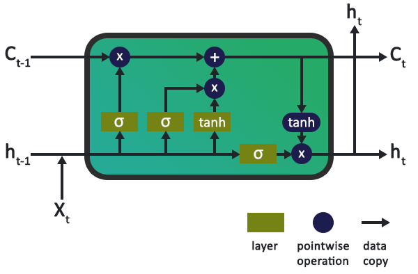

# RNN-LSTM-GRU

This article mainly follows the chain of [Olah's blog](http://colah.github.io/posts/2015-08-Understanding-LSTMs/) about LSTM. The reason I wrote this is because I want to merge the materials about the traditional RNN, LSTM, and GRU and their relationships together for the future reference and understanding. 

## RNN

why:

When we deal with the sequence, sometimes we need to depend on the previous information to predict the current value. The traditional forward neural network cannot "remember" this kind of information. Therefore, we need RNN to preserve the previous information for current use. 

what:

(This plot is from [This blog](http://www.wildml.com/2015/09/recurrent-neural-networks-tutorial-part-1-introduction-to-rnns/).)

$x_{t}$ is the input in the time $t$, which may be the one-hot vector of the corresponding word. $s_{t} = f(Ux_{t} + Ws_{t-1})$ is the hidden state of the RNN, which serves as "memory" of it, capturing the previous information. $o_{t} = \text{softmax}(Vs_{t})$ is the output of time $t$, which is the probability of the next word. 

**Note** that like CNN share weights for different locations, RNN shares all three parameters ($U, V, W$) for every time step, which greatly decrease the number of parameters. RNN not necessarily has input or output for every step, we can have only one output in the last step, e.g. predict the evaluation of some product based on the comment by the customer.  In practice, due to the problem of vanishing and exploding gradient, RNN cannot conserve information for many steps.   

## LSTM

why:

1. in the NLP problem, sometimes we need to solve the problem of "long-term dependencies", which means the word we want to predict is far from the hint presented before.
2. although traditional RNN can solve this problem, in practice, due to vanishing and exploding gradient problem, it is very hard to train RNN to solve "long-term dependencies", while LSTM is not bothered by these problems. 

what:

(The plot is from [This blog](https://www.altumintelligence.com/articles/a/Time-Series-Prediction-Using-LSTM-Deep-Neural-Networks))

**The effect of sigmoid and tanh function**

Sigmoid function is a gate, which decides which information can get through and the extend of it. tanh function is to push the output to $[-1, 1]$. 

**Cell, inputs, outputs**

$C_{t}$ is the cell of the LSTM, which is like "memory" in RNN, storing memory and controlling the flow of the information. 

$h_{t}$ is the output of the LSTM, which is the same as that of RNN, but note that in LSTM, we need to pass the output to the next LSTM cell (here, I mean the whole part of the above plot, sorry for the abuse!), which can decide the cells, gates and outputs for next cell. 

$ x_{t}$ is the input of the LSTM, corresponding to every word in the sequence.

**Gates**

1. forget gate (left-most sigmoid function): $f_{t} = \sigma(W_{f}\times[h_{t-1}, x_{t} + b_{f}])$, which decides which information and how much from the "memory" of last LSTM cell flow to this LSTM cell.
2. input gate (middle sigmoid function): $i_{t} = \sigma(W_{C}\times[h_{t-1}, x_{t}] + b_{C})$, which decides which information and how much from the "input" of this LSTM cell flow to the cell $C_{t}$.
3. input: $\hat{C}_{t} = \text{tanh}(W_{C}\times[h_{t-1},x_{t}] + b_{C})$, which is like the RNN input function to make the information from the last output and this input. 
4. output gate (right-most sigmoid function): $o_{t} = \sigma(W_{o}\times[h_{t-1}, x_{t}] + b_{o})$, which controls which information and how much of it will be output.
5. cell: $C_{t} = f_{t}\times C_{t-1} + i_{t} \times \hat{C}_{t}$, which depends on how much information from the last LSTM cell, this LSTM cell, forget gate and input gate.
6. output: $h_{t} = o_{t} \times \text{tanh}(C_{t})$, which depends on the output gate and the this cell. 

## GRU

why: 

LSTM is very complicated, so GRU greatly simplify the structure of it, at the same time, preserve the effects of the components.

what:

(This plot is from [This blog](http://colah.github.io/posts/2015-08-Understanding-LSTMs/).)

1. forget gate (left-most sigmoid function)

